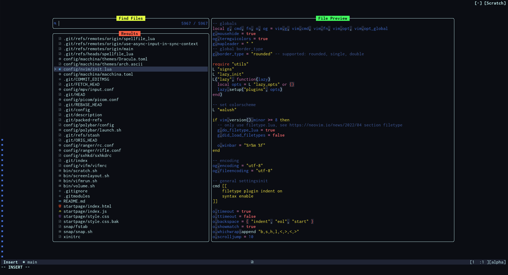
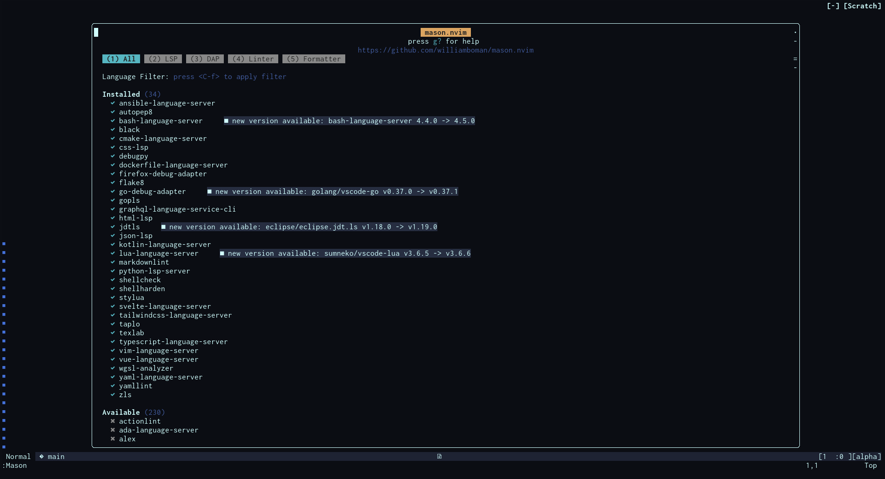
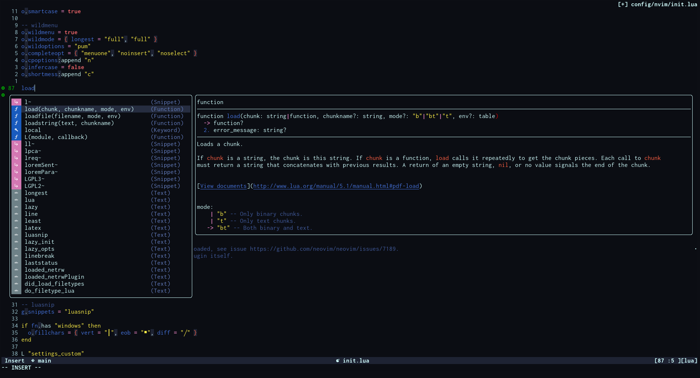

# Neovim Config

This repo contains my neovim config used as a submodule in my dotfiles.

## Setup

### Prerequsites

For this config to work you need at least neovim 0.8 release
installed, for full features use the current stable version. The easiest way if
you already have installed the rust toolchain is to install a neovim version
manager called [bob](https://github.com/MordechaiHadad/bob) otherwise download
a release from the repo or install it through your package manager.

the wilder plugin is using python and requires the neovim packages installed
with pip to work. _NOTE_ Install these before you startup neovim for the first
time otherwise the plugin will not pickup these packages and you have to
manually reinstall wilder.

### Installation

To enable this config clone this repository directly to `~/.config/nvim` or
create an symbolic link. On first startup the bootstrap process starts and
installs all plugins. After that restart neovim and you should be good to go.

#### Language servers

To install a Language server use the `:Mason` command for the interface or
install shorthand with `:MasonInstall <language server name>`. If you want
custom options or didn't install the server via mason you have to add it to
`lsp.lua` (see `lsp.lua.example`)

### Custom settings

For custom settings see `plugin/user_settings.lua.example`.
Color settings can be done via `lua/colors.lua`,
if not present colors fallback to a default theme
